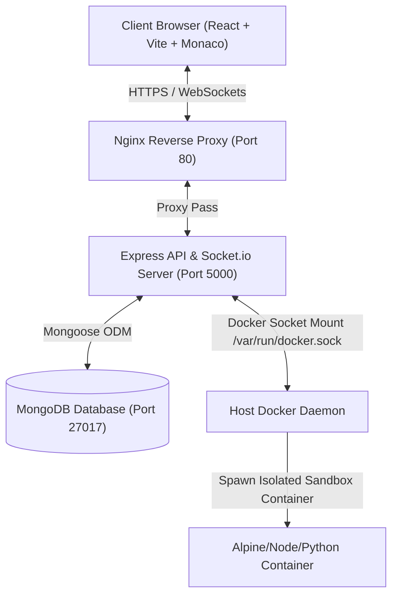

# Collaborative Cloud IDE for Team-Based Software Development

A production-ready, real-time collaborative code editor and secure sandbox environment for team-based software development. Built with Node.js/Express, React, Socket.io, MongoDB, and isolated Docker runtimes.

---

## 🚀 Key Features

* **Real-Time Collaboration**: Multi-user simultaneous document editing, live typing indicators, active presence listings, and visual cursor sharing (tracking names, cursor colors, and line coordinates) powered by **Socket.io** and **Monaco Editor**.
* **Secure Code Execution**: Run and compile code (Python, Node.js/JavaScript, TypeScript, C, C++, Java) in isolated, resource-constrained **Docker Containers** to prevent system attacks and CPU/memory exhaustion.
* **Version Snapshots & Timelines**: Save snapshots of the editor codebase, restore historical versions with full socket broadcast refreshes, and review a project activity timeline feed.
* **Collaborative Communication**: Real-time project workspace chat panel supporting message history and auto-scroll behaviors.
* **Team Management**: Email-based project invitation flow with custom roles (`Owner`, `Admin`, `Editor`, `Viewer`) and dynamic permission controls (inviting, promoting, and kicking collaborators in real-time).
* **Production Safeguards**: Global API and sandbox run rate-limiting, Helmet security headers, compression middlewares, Winston rotating daily files loggers, and React error boundaries.

---

## 🏗️ System Architecture

The following Mermaid diagram illustrates the system architecture, detailing user requests routing through Nginx to React, Node/Express, MongoDB, and the sibling Docker daemon execution socket:



---

## 🛠️ Technology Stack

### Frontend
* **Core**: React.js (v18.x) & Vite (v8.x) for fast bundle compilation.
* **Code Editor**: Monaco Editor (`@monaco-editor/react`).
* **Router**: React Router DOM (v6.x) with lazy loading and code splitting.
* **Styling**: Tailwind CSS system.
* **Sockets**: Socket.IO Client (v4.x).

### Backend
* **HTTP Runtime**: Node.js & Express API Server.
* **Database**: MongoDB & Mongoose.
* **Sockets**: Socket.IO Server.
* **Logging**: Winston Log rotation system.
* **Sandbox Execution**: Docker Engine containerization.

---

## 📂 Folder Structure

```text
collaborative-cloud-ide/
├── backend/                  # Node.js Express Backend
│   ├── data/                 # Local MongoDB database volume files
│   ├── logs/                 # Combined & error daily rotating logs
│   ├── src/                  # Backend application source code
│   │   ├── config/           # Configurations (Env loading, DB connection)
│   │   ├── controllers/      # Route controllers (Auth, Project, File, Sockets, etc.)
│   │   ├── middlewares/      # Security guards, JWT validation, validators
│   │   ├── models/           # Mongoose Database schemas
│   │   ├── routes/           # Express endpoint routers
│   │   ├── sockets/          # Socket.io connection and room event handlers
│   │   ├── utils/            # Winston logger config and helper scripts
│   │   └── server.js         # App entry server
│   ├── tests/                # Native process-isolated unit and integration tests
│   └── package.json          # Node server dependencies
├── frontend/                 # Vite React Client
│   ├── src/                  # React source code
│   │   ├── components/       # Custom React UI components (Navbar, Modals, Chat, Inbox)
│   │   ├── context/          # Global state contexts (AuthContext, ToastContext)
│   │   ├── hooks/            # Custom React hooks (useProjects)
│   │   ├── pages/            # View pages (Login, Dashboard, Workspace, Settings, Admin)
│   │   ├── routes/           # Lazy route mapping configurations
│   │   ├── services/         # Axios API connection layers
│   │   └── main.jsx          # React app entry script
│   └── package.json          # Client dependencies
├── docs/                     # Comprehensive Project Documentation
│   ├── ARCHITECTURE.md       # High-level architecture and Socket.io flows
│   ├── API.md                # REST API endpoints mapping
│   ├── DATABASE.md           # MongoDB schemas, relationships, and indexes
│   ├── DEPLOYMENT.md         # Deployment configurations (Vercel, Render, Atlas, VPS)
│   ├── SECURITY.md           # Security design details (JWT, RBAC, Rate Limiting, Helmet)
│   └── TESTING.md            # Automated testing scripts, performance, and security testing
└── docker-compose.yml        # Main multi-container orchestrator configuration
```

---

## 🔧 Environment Variables Configuration

Create a `.env` file in the `/backend` folder:
```ini
PORT=5000
MONGO_URI=mongodb://localhost:27017/collaborative-cloud-ide
JWT_SECRET=your_secure_jwt_secret_key_here
CLIENT_URL=http://localhost:5173
NODE_ENV=development
```

Create a `.env` file in the `/frontend` folder:
```ini
VITE_API_URL=http://localhost:5000/api
VITE_SOCKET_URL=http://localhost:5000
```

---

## 💻 Installation & Quickstart

### 1. Database & Docker Pre-requisites
Ensure MongoDB is running locally on port `27017`. Ensure the Docker Desktop Daemon is active.

### 2. Startup Backend
```bash
cd backend
npm install
npm run dev
```

### 3. Startup Frontend
```bash
cd frontend
npm install
npm run dev
```
Open **[http://localhost:5173](http://localhost:5173)** in your browser.

---

## 🧪 Running Automated Tests

We utilize Node's native built-in test runner to run process-isolated test suites (requiring zero external package overhead).
```bash
cd backend
npm install
node --test tests/auth.test.js tests/project.test.js tests/member.test.js tests/file.test.js tests/run.test.js tests/socket.test.js
```

---

## 🚀 Production Deployment Guide

### Frontend Deployment (Vercel / Netlify)
1. Import the `/frontend` folder to Vercel.
2. Set Environment Variables:
   * `VITE_API_URL`: Your deployed backend production URL (e.g., `https://api.yourdomain.com/api`).
   * `VITE_SOCKET_URL`: Your deployed backend Socket URL (e.g., `https://api.yourdomain.com`).
3. Deploy.

### Backend Deployment (Render / VPS)
* **Web Service (Render)**: Set the environment variables, set build command to `npm install`, and start command to `npm start`. Note: Sibling docker containers execution requires a Docker daemon, which is supported only on VPS deployments.
* **VPS Deployment (Docker Compose)**:
  Launch the entire multi-container stack in production using:
  ```bash
  docker-compose up -d --build
  ```

---

## 📸 Screenshots Section

| Feature View | Description |
| :--- | :--- |
| **Landing Page** | Sleek product introduction featuring dynamic service stats and backend connection status badges. |
| **Dashboard** | Project listings with search queries, archiving, favorites, and pending collaboration invitations inbox. |
| **Workspace & Editor** | Real-time code workspace featuring Monaco editor, file explorer tree, active cursors, live chat, and Team Management. |

---

## 🔮 Future Scope & Enhancements

* **AI Copilot Integration**: Leverage Google Gemini API to offer inline AI autocompletions, bug diagnostics, and chat code generation.
* **Voice & Video Channels**: Enable real-time WebRTC voice and video calls within project workspaces for seamless remote pairing.
* **Integrated Interactive Terminals**: Boot up secure pseudo-terminals (xterm.js) connected directly to sandbox containers for full CLI access.
* **Visual File Uploaders**: Support drag-and-drop file and image upload attachments within project chats and explorer logs.
"# collaborative-cloud-ide" 
