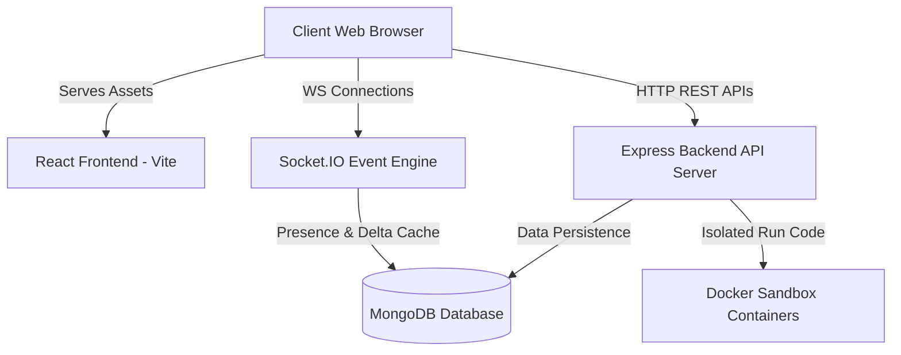
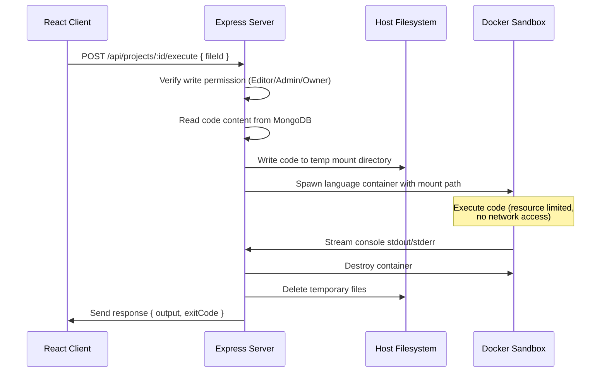

# Collaborative Cloud IDE - System Architecture

This document describes the end-to-end software architecture, technology choices, and data flows of the Collaborative Cloud IDE.

---

## 1. Architectural Overview

The application follows a client-server architecture model. It decouples the React frontend from the Express backend, linking them through REST API calls and real-time Socket.IO communication.

---

## 2. Component Runtimes

### Frontend Architecture
* **Single Page Application**: Powered by **React.js** and **Vite** for fast client bundle compilation.
* **Global State Engine**: Managed via **React Context API** (`AuthContext` handles credential sessions; `ToastContext` handles alert overlays).
* **Styling**: Tailored Tailwind CSS system for modern, high-contrast layouts.
* **Editor Layer**: Integrates **Monaco Editor** (`@monaco-editor/react`) for full syntax highlighting and autocomplete.
* **Bundle Optimization**: Employs React lazy loading and code splitting (`React.lazy` and `Suspense`) to partition the page routes (Workspace, Admin Dashboard, Settings), keeping the initial load payload minimal.

### Backend Architecture
* **HTTP Router**: **Node.js** and **Express** framework routing endpoints.
* **Controller Layer (MVC)**: Segregates feature logic (Projects, Files, Auth, Admin, Invitations) into reusable, decoupled controller modules.
* **Logging System**: Winston logger records errors and requests, dividing them into daily rotating log files (`combined.log`, `error.log`).
* **Security Middleware Stack**:
  * **Helmet**: Hardens HTTP headers.
  * **CORS**: Enforces origin restrictions.
  * **Rate Limiter**: Blocks brute-force and scraping scripts.
  * **Cookie Parser**: Retrieves JWT credentials from secure cookies.
  * **Express Validator**: Sanitizes incoming request bodies.

---

## 3. Core Architectural Flows

### Authentication Flow (JWT-in-Cookie)
1. The client sends login/registration details to the server.
2. The server hashes passwords using `bcrypt` (10 salt rounds) and verifies them.
3. The server generates a JSON Web Token (JWT) signed with a secret key.
4. The server writes the token back to the client using a secure cookie:
   * `httpOnly: true`: Blocks client-side JavaScript access (preventing XSS token theft).
   * `secure: true`: Restricts cookie transmissions to HTTPS connections.
   * `sameSite: "strict"`: Shields the browser session from Cross-Site Request Forgery (CSRF).
5. Subsequent API calls automatically attach this cookie, allowing authentication verification via the `protect` middleware.

---

### Socket.IO Collaboration Architecture
Real-time collaborative editing relies on targeted room boundaries:
1. **Connection Handshake**: During connection, Socket.IO reads the HTTP cookie header and decodes the JWT. If invalid, connection is refused.
2. **Project Presence Room (`project:${projectId}`)**:
   * Users join this room upon entering a workspace.
   * Handles user lists, online presence, active indicators, and group text chat messages.
3. **File Editing Room (`file:${fileId}`)**:
   * Scoped to the active code document being edited.
   * Handles visual cursor coordinate sharing (transmitting colors and cursor ranges) and live typing status (`isTyping`).
   * **Monaco Delta Sync**: Real-time keystrokes emit `code-change` events, sending delta ranges (character offsets and replacements) rather than full file buffers. This dramatically reduces network traffic.
4. **Memory Caching & Database Debouncing**:
   * Keystrokes accumulate in a server-side memory cache (`fileCodeCache`).
   * The server debounces writes to MongoDB by **2 seconds**. Every keystroke resets a timer. Once typing stops for 2 seconds, the cache is flushed to MongoDB. If a user disconnects, their unsaved cache is written immediately.

---

### Code Execution Flow (Docker Sandboxes)
Secure runtime executions execute in isolated container environments:

---

### Snapshot Versioning & Recovery Flow
1. **Save Version**: The owner/editor requests a snapshot. The backend compiles the flat project files list, packages them, and saves the snapshot in the `Version` collection.
2. **Restore Version**:
   * The user clicks "Restore".
   * The backend replaces the current project files list in the database with the snapshot version data.
   * The backend broadcasts a `force-file-sync` event via WebSockets to all connected project collaborators.
   * All active browser editors immediately reload and repaint their Monaco editor buffers with the restored code, ensuring synchronization.
