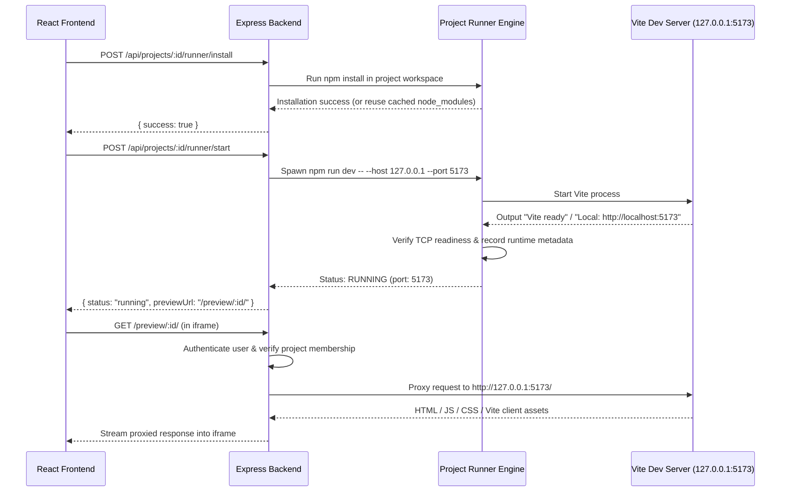

# Collaborative Cloud IDE - System Architecture

This document describes the end-to-end software architecture, component boundaries, data flows, and security domains of the Collaborative Cloud IDE.

---

## 1. Architectural Overview

The application follows a client-server architecture with an integrated execution runtime and preview reverse proxy. It decouples the React/Vite frontend from the Express backend, linking them through authenticated REST APIs, secure WebSockets (Socket.IO), and an internal reverse proxy for application live previews.

```
                         USER BROWSER
                              |
                              v
                    +-------------------+
                    | React Frontend    |
                    | Vite              |
                    | Monaco Editor     |
                    +---------+---------+
                              |
                     HTTPS / Socket.IO
                              |
                              v
                    +-------------------+
                    | Node/Express      |
                    | Backend API       |
                    +---------+---------+
                              |
             +----------------+----------------+
             |                                 |
             v                                 v
      +-------------+                 +----------------+
      | MongoDB     |                 | Runtime/Sandbox|
      | Atlas / DB  |                 | Manager        |
      +-------------+                 +--------+-------+
                                               |
                                     +---------+---------+
                                     |                   |
                                     v                   v
                                React/Vite           Node/Python
                                Dev Server           Code Sandboxes
                                     |
                                     v
                            Internal Port (e.g. 5173)
                            (Never directly exposed)
                                     |
                                     v
                           /preview/:projectId/
                                     |
                                     v
                              Browser Iframe
```

> **CRITICAL SECURITY DESIGN**: Internal runtime ports (such as `5173`) are bound locally to `127.0.0.1` and are **never** directly exposed to the public internet or external client browsers. All preview traffic routes through the authenticated `/preview/:projectId/` backend reverse proxy.

---

## 2. Component Runtimes

### Frontend Architecture
* **Single Page Application**: Built with **React 18** and **Vite** for fast HMR and compilation.
* **Global State Management**: React Context (`AuthContext` for auth/session state, `ToastContext` for user alerts).
* **Code Editor**: **Monaco Editor** (`@monaco-editor/react`) supporting syntax highlighting, multi-tab switching, remote cursor coordinate rendering, and collaborative text diff synchronization.
* **Terminal & Logs**: Terminal view for executing commands, viewing build outputs, and streaming real-time stdout/stderr from long-running dev servers.
* **Live Application Preview**: Embedded iframe communicating securely through `/preview/:projectId/`.
* **Styling**: Tailwind CSS layout with dark-mode theme, glassmorphic panels, and responsive navigation.

### Backend Architecture
* **HTTP / REST Router**: **Node.js** and **Express** framework serving REST API endpoints.
* **Real-Time Engine**: **Socket.IO** server handling user presence, Monaco cursor positions, typing indicators, project chat, and snapshot restoration notifications.
* **Database Layer**: **MongoDB** with **Mongoose ODM** managing users, projects, flat-file node trees, invitations, notifications, and version snapshots.
* **Execution & Runtime Engine**:
  * **Docker Sandbox Mode**: Dedicated container isolation using Docker daemon (`dockerode` / Docker CLI) with memory, CPU, and network limits for untrusted code execution.
  * **Native Process Runner Mode**: Controlled child-process runner (`projectRunner.service.js` / `reactProjectService.js`) with path resolution, environment sanitization, process lifecycle management, and output streaming for environments without Docker daemon access (e.g., standard Render web services).
* **Preview Reverse Proxy**: Express middleware using `http-proxy-middleware` that inspects user project membership, verifies running project port from memory/registry, and proxies HTTP and WebSocket traffic to internal application ports.
* **Observability & Logging**: Winston daily rotating logger capturing structured events with sanitized logging (credentials, secrets, and tokens are never logged).

---

## 3. Core Architectural Flows

### Authentication & Authorization Flow
1. **Credentials Verification**: User registers or logs in; passwords are verified using `bcryptjs` (10 rounds).
2. **Session Delivery**: Backend issues signed JWT in an `httpOnly`, `secure`, `sameSite: "strict"` cookie, and optionally sends the bearer token in the JSON response for cross-origin setups.
3. **API Authorization (RBAC)**: All sensitive routes pass through `protect` and `verifyProjectPermission`. Roles (`Owner`, `Admin`, `Editor`, `Viewer`) are strictly enforced server-side.
4. **Socket.IO Room Authorization**: Socket connections require valid JWT handshake. Joining `project:${id}` or `file:${id}` rooms requires verified database membership. Unauthenticated or unauthorized room joins are rejected.

---

### React/Vite Project Execution & Live Preview Flow


```mermaid
sequenceDiagram
    participant Browser as React Frontend
    participant Backend as Express Backend
    participant Runner as Project Runner Engine
    participant Vite as Vite Dev Server (127.0.0.1:5173)

    Browser ->> Backend: POST /api/projects/:id/runner/install
    Backend ->> Runner: Run npm install in project workspace
    Runner -->> Backend: Installation success (or reuse cached node_modules)
    Backend -->> Browser: { success: true }

    Browser ->> Backend: POST /api/projects/:id/runner/start
    Backend ->> Runner: Spawn npm run dev -- --host 127.0.0.1 --port 5173
    Runner ->> Vite: Start Vite process
    Vite -->> Runner: Output "Vite ready" / "Local: http://localhost:5173"
    Runner ->> Runner: Verify TCP readiness & record runtime metadata
    Runner -->> Backend: Status: RUNNING (port: 5173)
    Backend -->> Browser: { status: "running", previewUrl: "/preview/:id/" }

    Browser ->> Backend: GET /preview/:id/ (in iframe)
    Backend ->> Backend: Authenticate user & verify project membership
    Backend ->> Vite: Proxy request to http://127.0.0.1:5173/
    Vite -->> Backend: HTML / JS / CSS / Vite client assets
    Backend -->> Browser: Stream proxied response into iframe
```

---

### Real-Time Socket Collaboration Architecture

1. **Connection Handshake**: Socket.IO authenticates the connection via parsed cookie or handshake auth token.
2. **Project Presence Room (`project:${projectId}`)**:
   - Authorized members join upon entering workspace.
   - Emits `presence:list`, `user-joined`, `user-left`, and chat messages.
3. **File Editing Room (`file:${fileId}`)**:
   - Client sends `join-file` with `fileId`.
   - Backend queries database to ensure the requesting user is a member of the owning project before granting room entry.
   - Emits `cursor-position`, `remote-selection`, and `code-change`.
4. **Debounced Database Persistence**:
   - File edits are cached in memory and debounced to MongoDB (flushed after 2 seconds of inactivity or immediately upon user disconnection).

---

### Version Snapshotting & Rollback Flow

1. **Create Snapshot**: Authorized user requests snapshot. Backend packages all current file nodes of the project and stores a revision in the `Version` collection with commit message and author metadata.
2. **Restore Snapshot**:
   - Backend verifies write permission (`Owner`, `Admin`, or `Editor`).
   - Replaces current project file nodes with snapshot data.
   - Broadcasts `force-file-sync` and `snapshot-restored` via Socket.IO to all collaborators.
   - Connected clients automatically refresh file explorer and reload Monaco editor models without desynchronization.

---

## 4. Control Plane vs. Execution Plane

To support multiple deployment platforms safely:

| Component | Control Plane | Execution Plane (Docker Host) | Execution Plane (Render / PaaS) |
| :--- | :--- | :--- | :--- |
| **Responsibility** | Auth, Projects, Sockets, UI | Isolated Docker containers | Controlled Node child_process fallback |
| **Isolation** | Standard Node.js process | Hard container sandbox | Workspace directory sandboxing |
| **Port Exposure** | Public HTTPS (443 / 5000) | Bound to 127.0.0.1 only | Bound to 127.0.0.1 only |
| **File Access** | Database / App code | Mounted workspace path only | Workspace path with `safeJoin` validation |
| **Host Security** | Helmet, rate limits, CORS | Non-privileged containers | Path traversal protection, stripped env |
